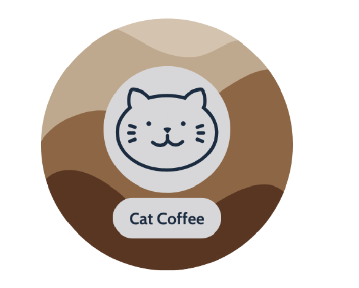

# Cat Coffe
An university project for the discipline Software Engineering II.

## Identification
Date created: 02/20/2024     
Project advisor: Lauriana Paludo                                                    
Project collaborators: Beatriz R. Nahas, Marjorie Ap. Cortez, Rafael C. Alves

### Website logo

## Introduction

### Purpose
a. The goal of the project is to create a site capable of carrying out and storing 
data of a user, show a complete catalog of products, redirect the user to the payment 
window, and send the information to the restaurant so that it can place and deliver 
the order to the customer.          

b. 
